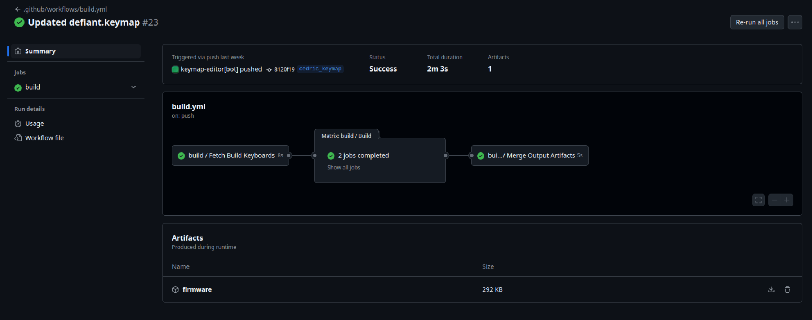
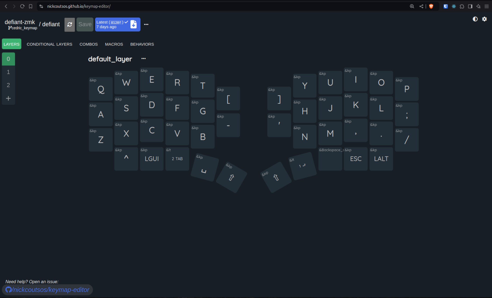

# Defiant ZMK

This Repository contains the ZMK configuration and keymap for the Defiant Keyboard

## Quickstart

Fork this repository. You probably want to change settings/keymaps for your version of the keyboard.

After that, enable actions on this repository.\
After Pipeline completion, the firmware will be automatically built.

Download the firmware. Connect one side of the keyboard with your computer.

Note: If the storage device does not show up, please try to reset the keyboard.

The keyboard will show up as a storage device.
Copy the correct version of the file onto the keyboard (`defiant-left-*.uf2` for left - `defiant-right-*.uf2` for
right).
The copy process might result in an error. This is totally fine!\
Repeat that process for the other side.

The Keyboard should advertise it own via Bluetooth as `Defiant`.

## ZMK Configuration

Copy `./boards/shields/defiant/defiant.conf` to `./config/defiant.conf`.
Visit the [ZMK Configuration](https://zmk.dev/docs/config) for configuration flags.

If you have to configure one side of the keyboard, edit `./boards/shields/defiant/Kconfig.defconfig`.

## Keymap editor

To edit your keymap with a gui, please open the [Keymap-Editor](https://nickcoutsos.github.io/keymap-editor/).
Log in with your GitHub account and allow access for this repository. After that, you can edit your keymap. Saving your
changes will result in a commit in this repository. A new pipeline with the new keymap will be created. Once finished
download and flash the new firmware ON THE RIGHT SIDE ONLY (responsible to interpret keystrokes, even from the left
side).